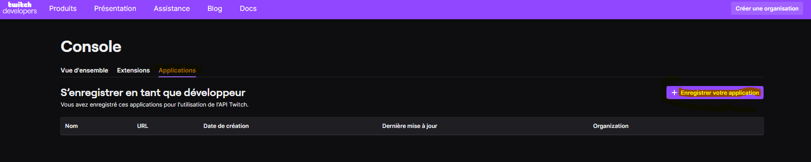
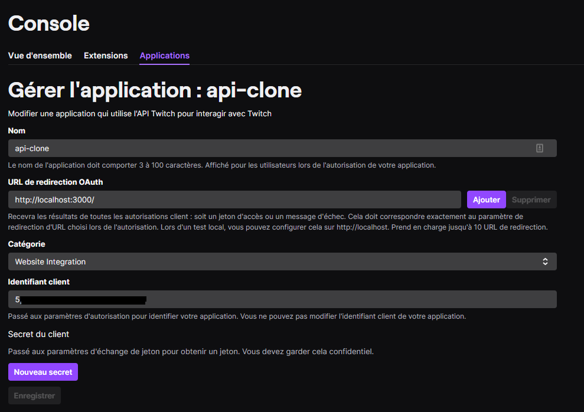

# React Twitch clone using functionnal programming and hooks

*January 2021*

> 🔨 Clone of Twitch (some functionnalities) using React ant Twitch API. It uses functionnal programming including React/React Router Dom hooks. From udemy '[Cloner Twitch avec React](https://www.udemy.com/course/cloner-twitch-avec-react/)'.


## Architecture

Src -- components
    |  |- Games
    |  |   |_ Games.js
    |  |- GameStreams
    |  |   |_ GameStreams.js
    |  |- Headers
    |  |   |_ Headers.js
    |  |- Live
    |  |   |_ Live.js
    |  |- Sidebar
    |  |   |_ Sidebar.js
    |  |- TopStreams
    |  |   |_ TopStreams.js
    |--apis.js
    |--App.css
    |--App.js

## Twitch API

[Twitch developers](https://dev.twitch.tv/): you will need to create an account

TWO FACTOR AUTHENTICATION (2FA) must be enabled.





After connect to:

[https://id.twitch.tv/oauth2/authorize?client_id={CLIENT_ID}&redirect_uri={REDIRECT}&response_type=token](https://id.twitch.tv/oauth2/authorize?client_id={CLIENT_ID}&redirect_uri={REDIRECT}&response_type=token) but replace {CLIENT_ID} by your application ID and {REDIRECT} by an url (one of the ones that you filled in your account), for instance : [http://localhost:3000/](http://localhost:3000/).

Accept conditions.

Then Twitch will provide you an URL to test:

- [http://localhost:3000/#access_token={TOKEN_PROVIDED}&scope=&token_type=bearer](http://localhost:3000/#access_token={TOKEN_PROVIDED}&scope=&token_type=bearer)

Then in *api.js*:

````js
import axios from 'axios';

let api = axios.create({
    headers: {
        "Client-ID": "CLIENT_ID",
        "Authorization": "Bearer TOKEN_PROVIDED"
        }
})
export default api;
````

Note: don't use `{}` in the credentials

## Dependencies

- [react-router-dom](https://www.npmjs.com/package/react-router-dom): DOM bindings for React Router.

`npm i react-router-dom`

- [react-twitch-embed-video](https://www.npmjs.com/package/react-twitch-embed-video): Your solution to embeding the Twitch video player in your ReactJS application.

`npm i react-twitch-embed-video`

## Useful links
- [Ziratsu/twitchclonereact](https://github.com/Ziratsu/twitchclonereact)
- [Twitch Developer Documentation](https://dev.twitch.tv/docs)
- [Hooks Introduced in React-Router v5.1](https://dev.to/finallynero/hooks-introduced-in-react-router-v5-1-7g8)